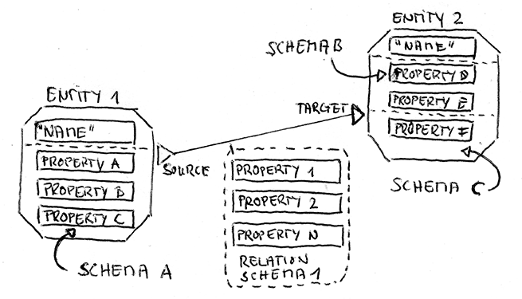
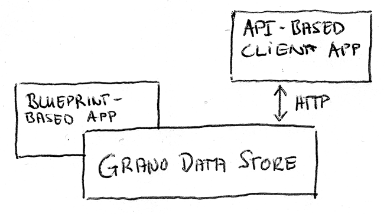

.. _techintro:

Technical Introduction
======================

The design goal for ``grano`` is to support the following basic features:

* Store a graph of *entities* and *relations*, where each relation connects 
  two entities (a *source* and *target*, i.e. a directed graph). There can
  be muliple relations between two entities.

* For each entity or relation, a set of *properties* is stored which signify
  individual attributes of an element. Properties are formalized using a 
  *schema*, which specifies the set of property names that are available.
  Relations can only be associated with one schema, entities can combine
  multiple schemata (see :ref:`schema`).

* Each property also stores information on who set it, when and what URL 
  they gave as a source for this fact. Previous values of the same
  property are kept and can be reconstructed. 

* Entities have a mandatory property, *name*, which is used to identify
  them. When attempting to find an entity, historic versions of the name
  property are considered aliases and will also match.

To store data, ``grano`` maps the graph onto a relational database schema.
While this may not be ideal in terms of performance, it means that the 
underlying model is well understood and can be filtered, aggregated and
projected onto a traditional table structure as needed.

How ``grano`` is used
---------------------

``grano`` itself does not attempt to be a full, user-facing tool. We belive
that graphs are a metaphor that requires a domain-specific interface to be
useful. For example, a database of political donors will require a very 
different presentation from a graph of procurement relations.

To build such a bespoke interface, two basic approaches can be considered:

* Extending the ``grano`` flask application using
  `blueprints <http://flask.pocoo.org/docs/blueprints/>`_, Python
  modules which handle web requests and render the information using 
  specific templates.
* Writing a client application that requests data from ``grano`` via its
  public REST API and then renders the information using specific 
  templates.

A third option, using JavaScript to generate the interface in the user's 
browser (i.e. a single-page app), would prevent search engines from indexing
content. This might be acceptable for internal deployments, but makes
the approach not viable for public offerings which would benefit heavily
from organic traffic.
